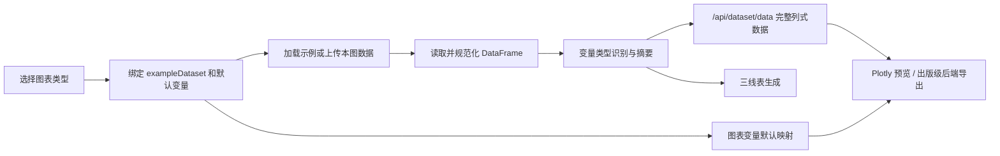

# 临床基础统计图形与三线表一键生成平台

**Clinical Basic Statistics Graphs & Three-Line Table One-Click Generation Platform**

面向临床科研数据的交互式图形与标准三线表生成平台。当前版本采用“先选图表，再下载示例/上传数据，再绘制”的 chart-first 工作流，并将总体逻辑向 `statistical_description` 项目靠拢：每类图表绑定对应示例数据、默认变量映射和完整数据绘图接口，避免先上传再重复选图造成流程混乱。

## 当前版本重点

- **图表优先工作流**：用户先在左侧纵向图表清单中选择目标图形，再加载本图示例、下载示例 CSV 或上传自己的数据。
- **示例数据与图表一一对应**：每个图表配置都声明 `exampleDataset`，前端选择图表后会绑定对应示例和默认变量。
- **完整数据生成图表**：新增 `/api/dataset/data`，图表渲染从后端读取完整列式数据，不再使用前 10 行预览数据。
- **变量默认映射**：常用图表会自动填入推荐变量，例如散点图默认 `age / bmi / group`。
- **纵向图表选择列表**：图表选择区改为单列纵向清单，选择后右侧工作台只展示当前图所需变量。
- **Researchwork 风格靠拢**：界面改为浅蓝纸面背景、白色玻璃感卡片、蓝色主按钮、更大的字号和更舒展的图形预览区，整体空间感向 `researchwork` 工作台靠拢。
- **紧凑摘要布局**：上传/示例数据摘要卡片改为紧凑网格，避免右侧信息过散。
- **CNS 出版级图形主题**：默认启用 CNS 出版主题，统一优化色板、字体、线宽、坐标轴箭头、标签、图例、热图、地图、韦恩图和 UpSet 图。
- **本地边界地图**：中国省界与世界国界分别使用 `china_provinces.geojson` 和 `world_countries.geojson`，不依赖外部 CDN。
- **稳定本地图表导出**：Plotly.js 已本地化到 `app/static/vendor/plotly.min.js`，图表区 PNG / SVG / CSV / 出版级按钮可直接导出当前结果；支持的图表还可通过 matplotlib/seaborn/geopandas 生成 PNG / SVG / PDF 出版级文件。
- **三线表变量多选生效**：前端多选变量会传入后端表格生成接口。
- **更稳健的数据读取**：CSV/TSV/TXT 自动识别编码和分隔符，并统一处理常见缺失值标记。

## 功能概览

- **多格式数据上传**：CSV / TSV / TXT / XLSX / XLS / XLSM
- **智能变量识别**：连续变量、分类变量、二分类变量、日期变量、ID 变量、地区变量、分组变量、结局候选变量
- **62 种图表类型**：基础统计图、临床高级图、展示感图、空间分布图
- **36 个示例数据集**：覆盖散点、柱状、折线、配对变化、疗效瀑布、Bland-Altman、校准曲线、Swimmer、生存、ROC、DCA、列线图、风险校准和多区域地图等场景
- **三线表一键生成**：基线资料表、描述统计表、缺失值统计表，支持自动 P 值计算
- **多主题图表**：CNS 出版、临床、期刊、Nature、暖色、深色低调主题
- **多格式导出**：PNG / SVG / PDF / CSV / Excel / HTML / ZIP

## 快速开始

### 环境要求

- Python 3.10+
- pip

### 安装

```bash
cd Basicpicture
python -m venv venv

# Windows
venv\Scripts\activate

# Linux / macOS
source venv/bin/activate

pip install -r requirements.txt
```

### 启动

```bash
python run.py
```

默认访问地址：

```text
http://127.0.0.1:8866
```

如果 8866 端口已有旧服务占用，可以临时换端口启动：

```bash
python -m uvicorn app.main:app --host 127.0.0.1 --port 8871
```

## 推荐使用流程

1. 在左侧“图表类型”中先选择想绘制的图。
2. 点击“加载示例”快速查看本图效果，或下载对应示例 CSV 后按模板整理数据。
3. 上传自己的 CSV/Excel，平台会重新识别变量类型并保留在当前图表工作台。
4. 确认变量映射、标题和主题，点击“生成图表”。
5. 在图形预览顶部导出 PNG / SVG / CSV / 出版级文件。
6. 切换到“三线表”页生成基线、描述或缺失统计三线表。

## 核心数据流



## 图表与示例数据映射

| 图表类型 | 示例数据 |
|---|---|
| 散点图、分组散点图 | `scatter_example` |
| 柱状图、堆叠柱状图、横向条形图、分组柱状图、百分比堆叠柱图、棒棒糖图、误差线图 | `bar_example` |
| 折线图、多组折线图、面积图 | `line_example` |
| 直方图、密度图、箱线图、箱线图+散点 | `boxplot_example` |
| 小提琴图、小提琴+箱线+散点 | `violin_example` |
| 哑铃图 | `dumbbell_example` |
| 斜率变化图、配对前后连线图 | `paired_change_example` |
| 肿瘤疗效瀑布图 | `waterfall_example` |
| Bland-Altman 一致性图 | `method_comparison_example` |
| 校准曲线 | `calibration_example` |
| Swimmer 治疗过程图 | `swimmer_example` |
| 人群金字塔图 | `population_pyramid_example` |
| 正态 QQ 图 | `boxplot_example` |
| 森林图 | `forest_example` |
| 火山图 | `volcano_example` |
| 气泡图 | `bubble_example` |
| 热图 | `heatmap_example` |
| 相关性热图、缺失值热图、PCA | `baseline_table_example`（含真实缺失模式） |
| Kaplan-Meier 生存曲线 | `survival_example` |
| ROC 曲线 | `roc_example` |
| 多模型 ROC 曲线 | `roc_example` |
| 风险校准图 | `risk_calibration_example` |
| 列线图 / 风险评分图 | `nomogram_example` |
| DCA 决策曲线 | `dca_example` |
| 云雨图、蜂群图 | `raincloud_example` |
| 豆荚图 | `beanplot_example` |
| 韦恩图 | `venn_example` |
| UpSet 交集图 | `upset_example` |
| 中国疾病分布地图 | `china_map_example` |
| 世界疾病分布地图 | `world_map_example` |
| 中国省域气泡地图 | `china_map_example` |
| 美国州级分布地图 | `usa_map_example` |
| 欧洲疾病分布地图 | `europe_map_example` |
| 英国区域气泡地图 | `uk_map_example` |
| 全球气泡分布地图 | `world_map_example` |

## 项目结构

```text
Basicpicture/
├── README.md
├── requirements.txt
├── pyproject.toml
├── run.py
├── app/
│   ├── main.py                  # FastAPI 路由和应用入口
│   ├── config.py                # 路径和运行目录配置
│   ├── schemas.py               # Pydantic 请求模型
│   ├── services/
│   │   ├── io_service.py        # 上传、示例、编码/分隔符识别、数据读取
│   │   ├── variable_service.py  # 变量类型识别和数据摘要
│   │   ├── stats_service.py     # 描述统计和组间比较
│   │   ├── table_service.py     # 三线表数据生成
│   │   ├── chart_service.py     # 后端图表变量/数据辅助接口
│   │   ├── sample_service.py    # 示例数据生成函数
│   │   ├── export_service.py    # 表格和配置导出
│   │   └── publication_chart_service.py # matplotlib/seaborn 出版级图表导出
│   └── static/
│       ├── index.html
│       ├── china_provinces.geojson
│       ├── world_countries.geojson
│       ├── css/
│       │   ├── theme.css
│       │   ├── layout.css
│       │   ├── components.css
│       │   └── tables.css
│       └── js/
│           ├── utils.js
│           ├── upload.js
│           ├── dataPreview.js
│           ├── variableSelect.js # 图表变量槽位和默认映射
│           ├── plotConfigs.js    # 图表目录和 Plotly trace/layout
│           ├── charts.js         # 图表选择、示例切换、完整数据加载、渲染
│           ├── tableGenerator.js
│           └── download.js
├── data/
│   ├── examples/
│   └── uploads/
├── outputs/
├── docs/
│   ├── INTEGRATION.md
│   └── EXTENSION.md
└── tests/
    └── smoke.py
```

## API 概览

| 端点 | 方法 | 说明 |
|---|---|---|
| `/api/health` | GET | 健康检查 |
| `/api/upload` | POST | 上传数据文件并返回预览、变量识别和摘要 |
| `/api/read-sheet` | POST | 读取 Excel 指定工作表，支持 JSON body |
| `/api/examples` | GET | 列出示例数据集 |
| `/api/examples/{name}` | GET | 获取示例数据预览和变量识别 |
| `/api/examples/{name}/download` | GET | 下载单个示例 CSV |
| `/api/examples/download-all` | GET | 下载全部示例 ZIP |
| `/api/dataset/data` | POST | 返回完整列式数据，供前端图表渲染使用 |
| `/api/variable-types/{name}` | GET | 获取示例数据变量类型 |
| `/api/stats/descriptive` | POST | 描述统计 |
| `/api/stats/compare` | POST | 组间比较 |
| `/api/chart/variables` | POST | 获取图表变量推荐 |
| `/api/chart/data` | POST | 后端图表数据辅助接口 |
| `/api/table/baseline` | POST | 生成基线资料表 |
| `/api/table/descriptive` | POST | 生成描述统计表 |
| `/api/table/missing` | POST | 生成缺失值统计表 |
| `/api/export/table-csv` | POST | 导出表格 CSV |
| `/api/export/table-excel` | POST | 导出表格 Excel |
| `/api/export/table-html` | POST | 导出表格 HTML |
| `/api/export/chart-config` | POST | 导出图表配置 JSON |
| `/api/export/chart/publication` | POST | 导出支持图表的出版级 PNG / SVG / PDF |

### 完整数据接口示例

```bash
curl -X POST http://127.0.0.1:8866/api/dataset/data \
  -H "Content-Type: application/json" \
  -d '{"use_demo": true, "dataset_name": "scatter_example"}'
```

返回核心结构：

```json
{
  "name": "scatter_example",
  "row_count": 200,
  "col_count": 9,
  "columns": ["patient_id", "age", "bmi", "sbp", "dbp", "glucose", "cholesterol", "sex", "group"],
  "variable_types": {},
  "summary": {},
  "data": {
    "age": [58, 66, 49],
    "bmi": [23.8, 27.4, 21.9]
  }
}
```

## 开发与验证

```bash
python tests\smoke.py
python -m compileall app
node --check app\static\js\variableSelect.js
node tests\chart_config_smoke.js
node --check app\static\js\charts.js
node --check app\static\js\upload.js
node --check app\static\js\tableGenerator.js
```

## 集成与扩展

- 二次集成说明：[docs/INTEGRATION.md](docs/INTEGRATION.md)
- 添加新图表、新示例、新主题：[docs/EXTENSION.md](docs/EXTENSION.md)

## 许可证

MIT License
